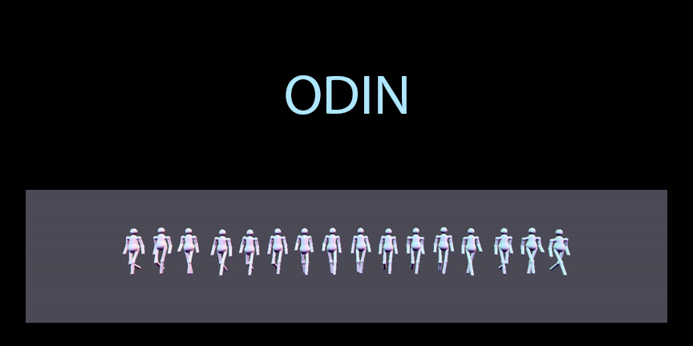
View Demo [Here](http://vimeo.com/hannahbollar/odin)
# Odin: gpujs BioCrowds with WebGL2 Visualization

**University of Pennsylvania, CIS 565: GPU Programming and Architecture, Final Project**


#### Developers:
- Hannah Bollar: [LinkedIn](https://www.linkedin.com/in/hannah-bollar/), [Website](http://hannahbollar.com/)
- Eric Chiu: [LinkedIn](https://www.linkedin.com/in/echiu1997/), [Website](http://www.erichiu.com/)

____________________________________________________________________________________

     

[//]: #(

## Overview

We implemented a crowd simulation in which our main focus was not on the algorithm itself but on the pipeline in gpu.js and the final crowd visualization.

For our crowd simulation, we're using the BioCrowds algorithm, a common simulation algorithm for moving `agents` around a scene. The technique was originally modeled after the vein pattern in leaves. This idea ultimately helps prevent `agents` from colliding with one another by using `markers` to keep a buffer range. Conventionally, this is modeled using the space colonization algorithm with `markers` scattered throughout the simulation space. During each `timeStep`, each `markers` is associated with the closest `agent` (within a max distance), and velocity for each `agent` is then calculated based on these `markers`.

A twist on this crowd simulation is that we wanted to push the boundaries of what we knew in JavaScript, so we split up the work to better tackle specific features. Hannah implemented the initial WebGL 2.0 pipeline and the entire backend gpu.js pipeline along with `render pass` manipulations for the actual BioCrowds algorithm, and Eric implemented the WebGL 2.0 procedural sdf-based crowd visualization with bounding capsule and texture data storage optimizations.

## Breakdown

- [Crowd Behavior](#crowd-behavior)
	- [What is gpu.js?](#what-is-gpujs)
	- [How does our BioCrowds Implementation Work?](#biocrowds-implementation)
	- [Pipeline using gpujs](#pipeline-using-gpujs)
	- [Hurdles](#hurdles)
	- [Tips for Using gpujs!](#tips-for-using-gpujs)
	- [Performance Analysis](#gpujs-performance-analysis)
- [Crowd Visualization](#crowd-visualization)
	- [Signed Distance Fields](#signed-distance-fields)
	- [Animation](#animation)
	- [Body Size](#body-size)
	- [Optimizations](#optimizations)
	- [Bounding Capsules](#bounding-capsules)
	- [Texture Data Storage](#texture-data-storage)
	- [Performance Analysis](#visualization-performance-analysis)
- [Build and Run Instructions](#build-and-run-instructions)
- [References](#references)
- [Milestones](#progress-milestones)
- [Bloopers](#bloopers)

## Crowd Behavior

### BioCrowds with gpujs

#### What is gpujs

[gpu.js](http://gpu.rocks/) is an interesting blend between a gpu kernel and a webgl shader. On the user-end, the code looks and is easily understood as a kernel that can be switched from a gpu pass and cpu pass by a simple toggle; however, under the compiler hood each kernel function acts as its own fragment shader. Additionally, gpujs contains optimizations such as superKernels and megaKernels to wrap these shader creations together. One think that was helpful is that variables created and passed in by the user are prepended with a `user_` to prevent duplicates, and it also helps for debugging.

Features like a shader:
- compiles out with a shader wrapper
- can specifically pass in `uniform` variables (they label them as `constants`) instead of just a constant `in` variable
- `this.color` acts as `outColor` from general OpenGL or WebGL coloring
- `in` variables which are parameters to the methods
- can only be in 3D array technically because of the limited thread indexing for just `x, y, z`; however, it doesnt limit the array lengths for each of these dimensions.

Features like a kernel:
- methods have to be added to the gpu when written - pass in the `function` and an `options: { parameters, returnType }`.
- not restricted by four color channels, so can output to an n-dimensional by n-dimensional by n-dimensional array if you wish to do so.
- `parameters` - method parameters that also can be considered `in` variables as mentioned above.
- access elements and information based on `this.thread.component`

#### BioCrowds Implementation

Generally as explained in the [introduction](#overview), BioCrowds is simulated using randomly placed `markers`; however, since we're threading this with texture passes, one way to streamline this is to use each pixel as a marker. 
Note: Since we're using pixels instead of randomly placed markers, there's more likely to occur stuck states where certain agents can't pass one another though both need to do so. One fix for this is to re-introduce this margin of error by creating a height-field and using the 3d-distance (though this still isnt optimal) or using tilted-cones to the left of the direction of velocity for the depth-buffer pass to re-introduce some preference of direction.

Additionally, to optimize marker to agent checking, we associate each marker (pixel) with each `agent` for the first pixel pass through. Once this pixel distance check part is finished, the value it holds corresponds to the iteration color of the agent when it was first created. That is, the value corresponds to the `agent_index / total_number_of_agents` so that it's on a proper `[0, 1)` scaling for visual output and can be easily used to port back for indexing into the stored `positions` and `velocity` arrays for further calculations.  

In our implementation we have the original positions of all agents randomized, and their targets set either along a line on the upper or lower half of the screen.

For more information on implementation optimizations - read the Crowd Simulation part of the [references](#references) section below. 

#### Debug Views

Voronoi Check for first Coloring Setup | Border Buffer Check  | Pixel to Associated Agent Id
|:-------------------------:|:-------------------------:|:-------------------------:|
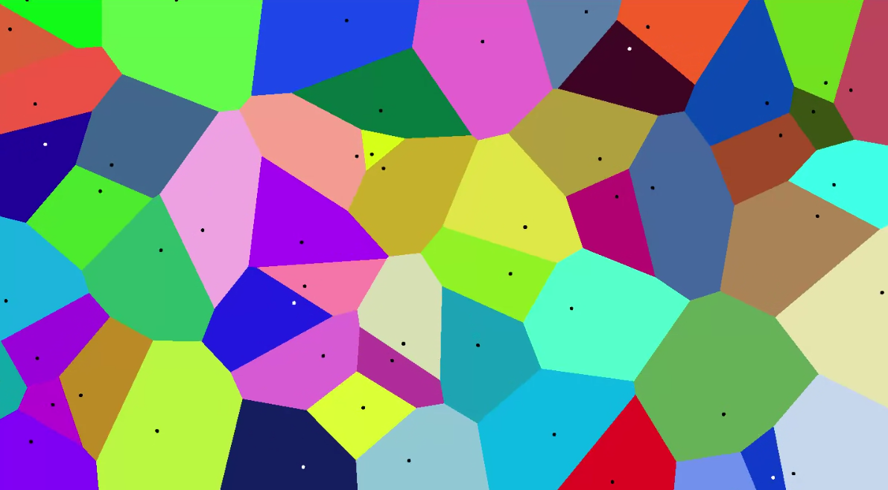| 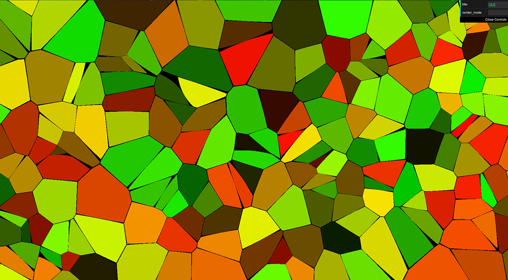 |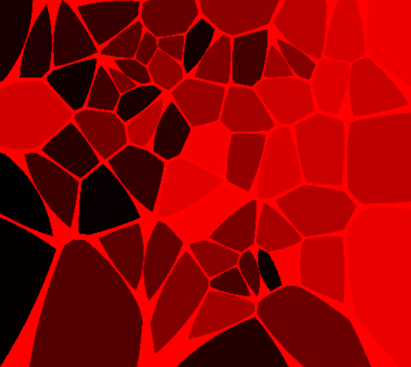

| First Weighting Pass | Velocity Weighting For Update|
|:-------------------------:|:-------------------------:|
| 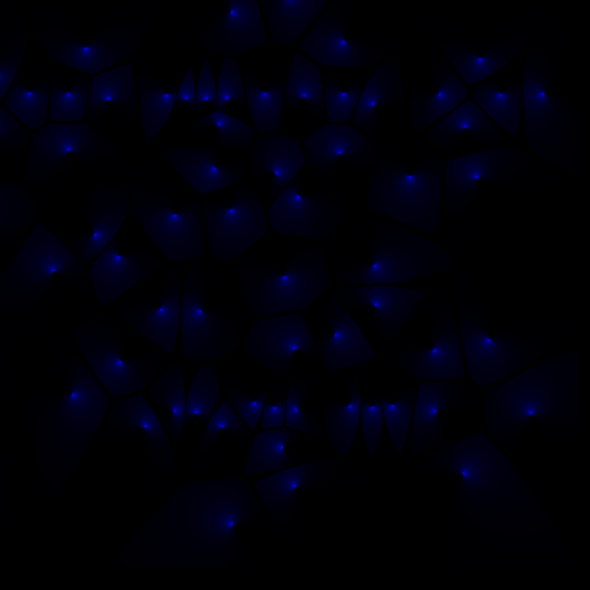 |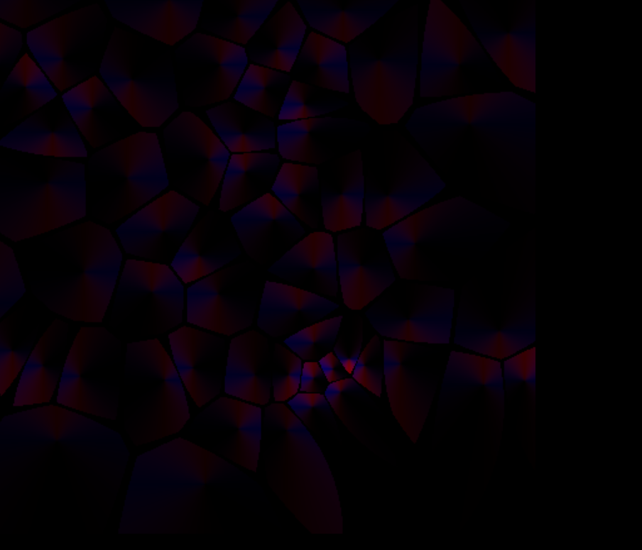

| Velocities at each Agent Position | Combined View|
|:-------------------------:|:-------------------------:|
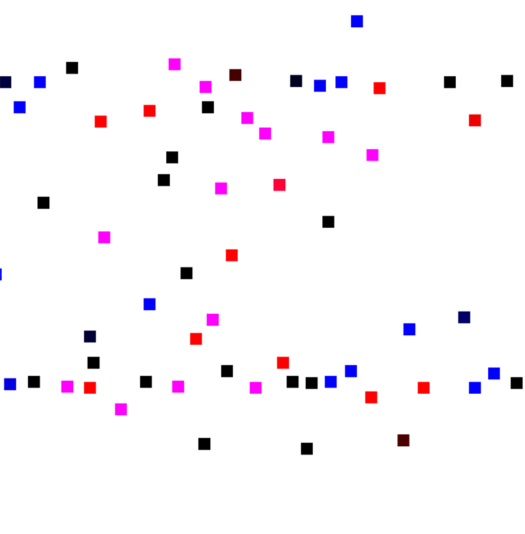| 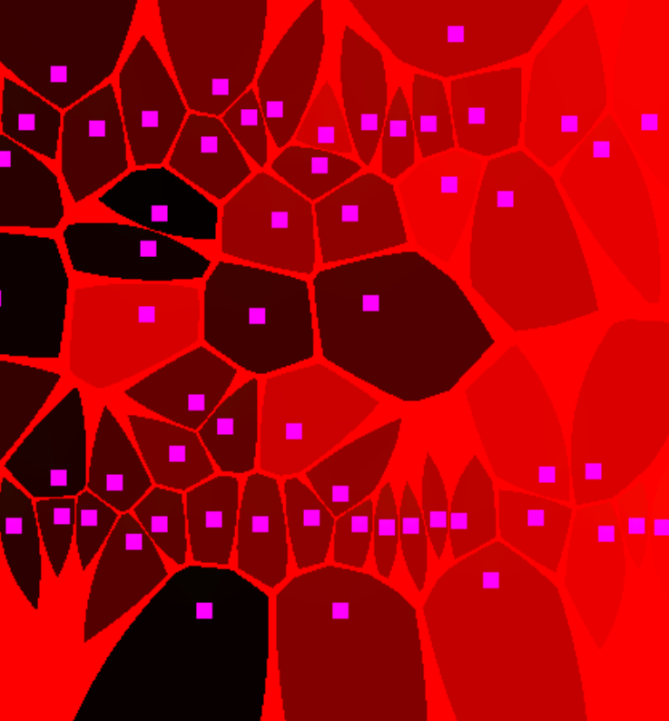

#### Pipeline using gpujs

In the progress of this implementation, there were two noteworthy pipeline iterations. The most noteworthy was the following pipeline in that it worked at `~60fps` due to the help of the `superKernel` and the common use of `outputToTexture` passes for information. 

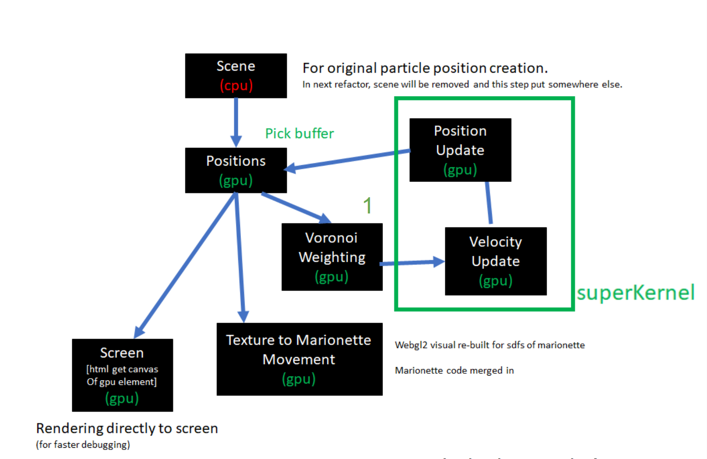

However, even with the optimizations, it kept erroring for certain output values and wasnt optimal to debug due to mutliple steps being in wrapper functions. To fix this, we switched to the below pipeline. Though it has more function calls, they're much smaller and sectioned out better. By itself (ie without the webgl sdf updates), it runs at about `~10-12 fps`. Not optimal, but it works. This is still to be resolved and optimized later.

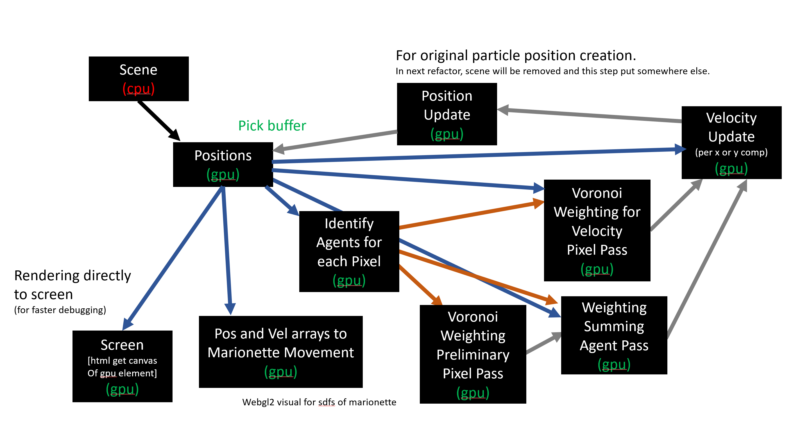

#### Hurdles

Inside of the actual `gpu.kernel` calls, there were issues with `vec3` and `vec2` creations (which is currently a known issue with gpu.js). In a usual fragment shader, `line 0` and `line 1` should compile out both to `vec3`s; however, because of the wrapping in gpu.js, they compile out to two separate outputs:
```
(0) var v_1 = vec3(0, 1, 0);    --> float user_v_1 = vec3(0, 1, 0);
(1) const v_2 = vec3(0, 1, 0);  --> float user_v_2 = vec3(0, 1, 0);
```
The gpu.js library introduced `this.vec3` (and others) to accomodate for this; however, the version we used seems to only compile as expected when using `const`, so to avoid this issue and unnecessary variable creations general multi-dimensional arrays and individual color channels were favored instead.
```
(0) var v_1 = this.vec3(0, 1, 0);    --> float user_v_1 = vec3(0, 1, 0);
(1) const v_2 = this.vec3(0, 1, 0);  --> vec3 user_v_2 = vec3(0, 1, 0);
```

Additionally, there ended up being a lot of issues with indexing especially for the `position` and `velocity` arrays. The issues were mainly because the kernel's output is written to a buffer in the following forms
```
3D: [width, height, depth]
2D: [width, height]
1D: [length]
```
which is simple enough however, when indexing into this with the kernel's threads, it's actually in the following orders
```
3D: arr[this.thread.z][this.thread.y][this.thread.x]
2D: arr[this.thread.y][this.thread.x]
1D: arr[this.thread.x]
```
which led to everytime certain kernels were updated or optimized to a different dimention, there would be a bit of confusion for some values when debugging. Once there was the understanding of the alternating indices, most updates began working properly.

Lastly, the pipeline was functioning almost fully, except for the final weighting calculation for the velocity update, which was partially due to putting together superKernels with improper parameters which wasnt discovered 'til later (such as a section where a 2D array was expected, but a 1D one was being used by mistake) so to resolve this, the pipeline was updated yet again from the more optimal version to the last one that works (go back to the [pipeline](#pipeline-using-gpujs) for more info).

### Tips for using gpujs

- `setGraphical(true)` - </br> this output call was super helpful in that could allow the user to render directly to canvas. This was used on multiple occasions, not just for render passes and debug views but also for setting up the initial framework to check for the vertical flip in the texture pass and if two different steps in the pipeline were rearranged with different positions due to a mistake even when no positional updates occured.

- `outputToTexture(true)` - </br> Instead of porting the output back to the cpu to be read in by another kernel `gpu out --> cpu --> gpu in`, this leaves the output as a WebGL texture allowing for the process to become `gpu out --> gpu in` for information passing between kernel. One of the ways to show off the power of gpujs!


- `const x_i = this.thread.y;
 const y_i = this.thread.x;` - </br> One way to make indexing easier, especially for texture output passes, was to rename the thread indices to readable values. Often the code would end up being of the form `value.x + this.thread.x` instead of what was expected as `value.x + this.thread.y`. Even for general arrays, switching to `const which_vec2 = this.thread.y; const vec2_element = this.thread.x;` to identify `vec2` or `vec3` or (etc) component and the element of that vector was more readable for later debugging.


- `[NUM_ITEMS, 2] vs [2, NUM_ITEMS]` - </br> this just comes down to, do you prefer row major or column major. I often found that when writing kernel output arrays in the conventional form `[column_length, index]` and even calling from the arrays the same way; however, this caused issues, because `[NUM_ITEMS, 2]` corresponds to a `width: NUM_ITEMS` and a `height: 2`; however indexing into it would be `[this.thread.y][this.thread.x]`, so the code was often written in the form `positions[0][index]` to get the `x` value of the position in question which got to be a bit confusing. Especially, because the output wouldnt match the same `(x, y)` indexing scheme as some of the fully canvased `width x height` dimensioned arrays because of flip-flopping between iterations. To resolve issues like this and for readability for general array outputs (not necessarily texture outputs), make sure your `setDimensions(...)` has its parameters in the form of `[2, NUM_ITEMS]`. That way, it matches the convention a bit more for expected indexing and copying over ideas for actual fragment shaders like `shaderFun` would be more expected to index properly as well.


- `render_output` - </br> html canvas elements are your friend. You can generally draw directly to the document, or if you use `outputToTexture` (which will also make your code much faster!). `outputToTexture` is also handy in that it uses the `canvas` element passed into the `gpujs` element when it was created, meaning by just calling `outputToTexture`, the image automatically shows up on your screen (like when there's a texture left bound in the OpenGL pipeline).


- `gpu.addFunction` - </br> this becomes super helpful if you code is redundant and/or uses a lot of complicated math (like in procedural work, etc) that needs to be encapsulated for readability.


- `debug views` - </br> when building a project - either for machine learning, graphics, etc - have a visual debug output for JavaScript is extremely helpful because it can tell the user in one look, what values are enclosed and a general range of them as well. Printing to console is also helpful; however, it's not as fast and the actual act of printing can slow down the general runtime excessively while also clogging up possible console error messages.


- `superKernel and megaKernel` - </br> both of them are incredibly helpful not only for streamlining method calls from one output to another in terms of code-readability, but also for optimizating runtime since the compiler recognizes the texture and/or general array connection between the methods and optimizes for this pass during initial compile time instead of during runtime. much faster!

### gpujs Performance Analysis

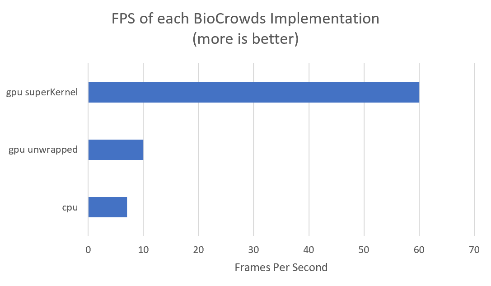

In comparison to a general cpu JavaScript implementation, the non working gpujs pipeline was extremely efficient with an improvement of about `+15fps` from the cpu implementation depending on the number of agents; however, as mentioned in the [pipeline](#pipeline-using-gpujs) section, this streamlined implementation with the superKernal wrapping had to be unwrapped for debugging purposes, leaving us with a not as optimized version running at about `10fps`. This is still a bit better than the general JavaScript implementation at `7fps`, showing off the power of gpujs! (note: number of agents used in the comparison simulation runs: `64`).

## Crowd Visualization

### Signed Distance Fields

Randomization makes the scene visually dynamic. With agents varying in movement, shape, and size, the crowd simulation becomes more interesting. The advantage of sphere-tracing signed distance fields is that we can procedurally generate a variety of characters with ease. Two procedural techniques were used to tackle animation and body size.

#### Animation

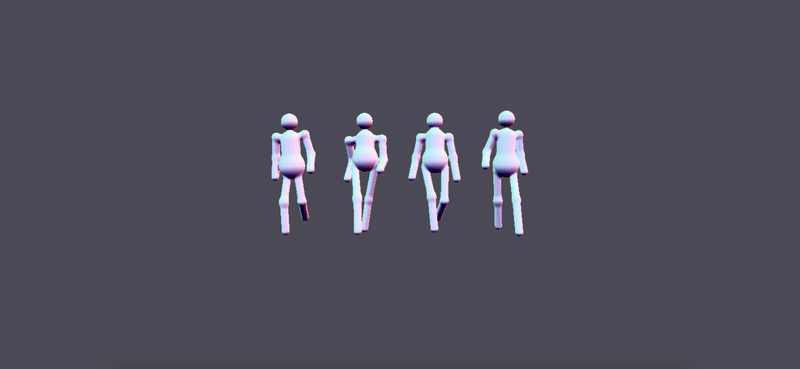

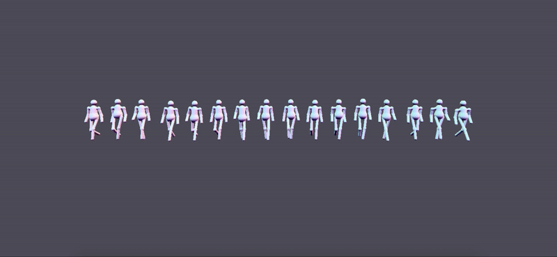

#### Body Size

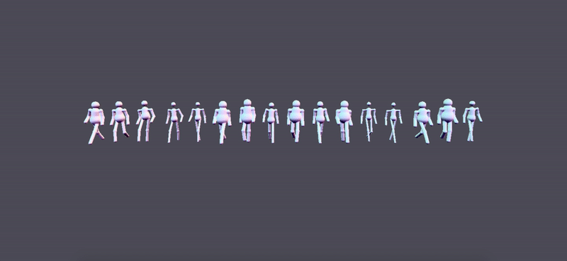

### Optimizations

Sphere-tracing, a form of ray-marching, is costly when there are hundreds, if not thousands, of agents in the scene. In order to support a large number of agents, two optimizations were used: bounding capsules and texture data storage.

#### Bounding Capsules

For every step in the ray march, we have to evaulate the signed distance functions for every body part of every agent. This is because we are trying to find the distance to the closest shape (signed distance function). We use this distance value to move forward that amount in the next ray march step. If there are 200 agents, and 13 sdfs represent 1 agent, we are performing a min distance comparision 2600 times every ray march step (not to mention we perform a raymarch for every pixel on the screen). 2600 min distance comparisons is costly, so if we figure out a way to reduce the number of comparisons, crowd visualization performance will greatly improve.

A method of reducing the number of min distance comparisons is to treat each agent as one shape, a bounding capsule, when the position of a ray march is far away from an agent. When the position of a ray march is close to an agent (by an epsilon value), we can then treat the agent as 13 "higher resolution" sdfs. That way, we are only performing the 13 min distance comparisons when it is important.

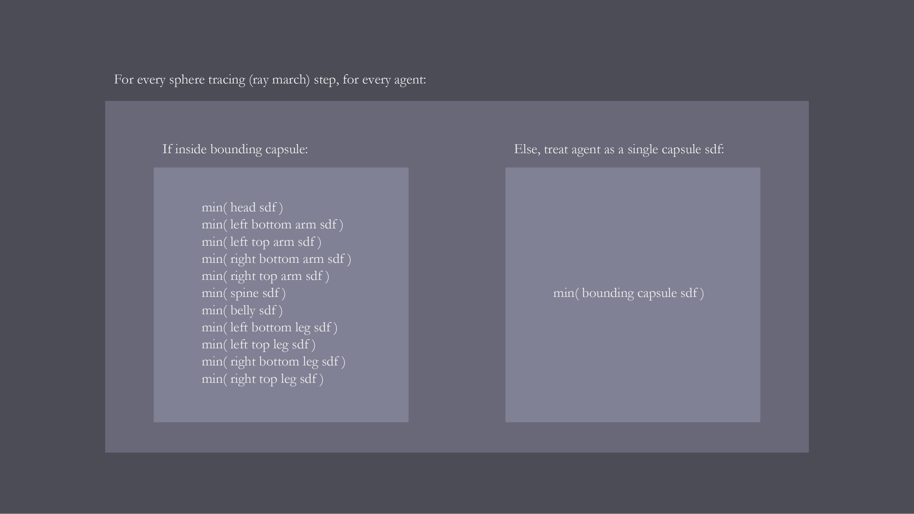

#### Texture Data Storage

For every step in the ray march, we have to calculate the world positions of the 15 joints for every agent. This is because every agent has its own world position, world forward direction, and local procedural animation. 

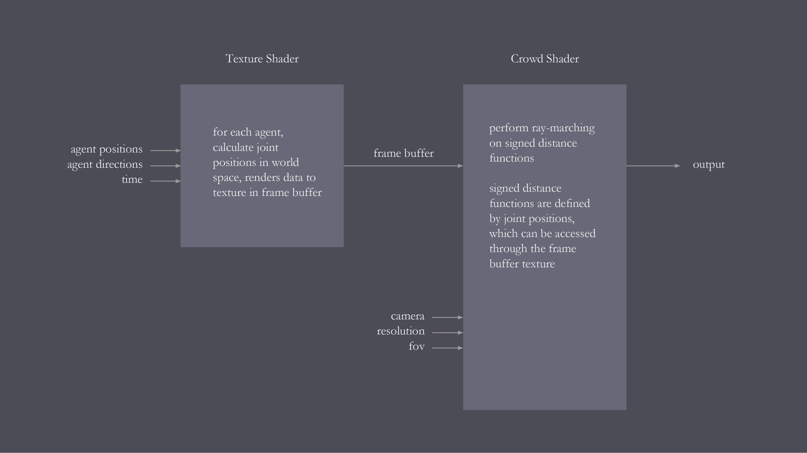

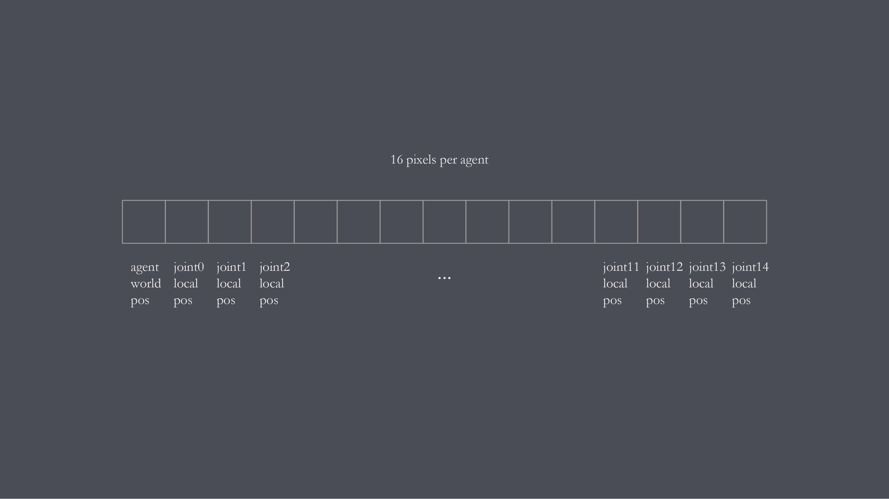

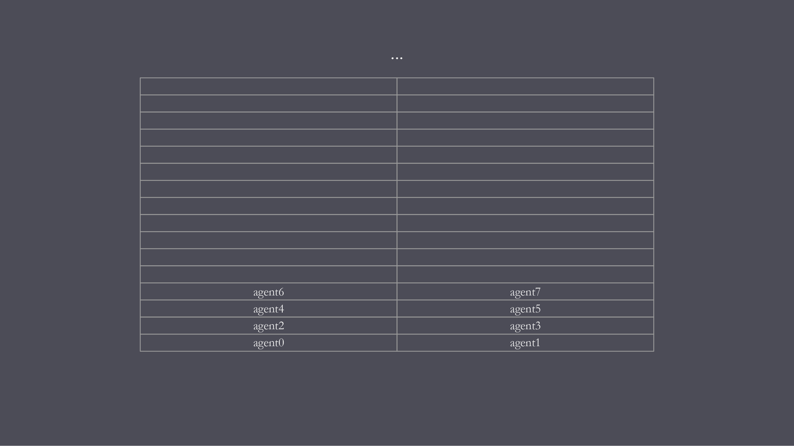

#### Visualization Performance Analysis

The bounding capsules optimization allowed the simluation to run roughly 10 times faster given the same number of agents.


## Build and Run Instructions

#### Build
```
Clone this repository
Navigate to your root directory and run the following commands
`npm install` 
```

#### Run
Need WebGL2-capable browser to run this project. Check for support on [WebGL Report](http://webglreport.com/?v=2) 

```
Navigate to your root directory and run the following commands
Run `npm start`
Navigate to http://localhost:5650 on a browser that supports WebGL2
```

*Note: Currently there is a camera bug. When the simulation-scene first loads to gray, slowly click and drag to the left with your mouse until the figures appear (this issue only occurs in the simulation scene)*

#### Tested on:
- Systems:
	- Windows 10 Home, i7-8550U @ 1.8GHz 15.8 GB (personal)
	- Mac OS X El Capitan 10.11.6, 2.5 GHz Intel Core i7, AMD Radeon R9 M370X 2048 MB (personal)
- Browsers:
	- Google Chrome Version 70.0.3538.77 (Official Build) (64-bit)
	- Firefox Version 63.0.1 (Official Build) (64-bit)

## References

- gpu.js
	- [gpu.js](http://gpu.rocks/)
	- [gpu.js github](https://github.com/gpujs/gpu.js) 
	- [gpu.js include examples](http://geoexamples.com/other/2018/04/30/mapping-with-gpujs.html])
	- [gpu.js typescript ex 1](https://staceytay.com/raytracer/)
	- [gpu.js typescript ex 2](https://github.com/abhisheksoni27/gpu.js-demo)
	- [issues with vec3 and vec4 in glsl in gpu.js](https://github.com/gpujs/gpu.js/issues/7)
	- [add native function so can use alternate glsl functions like in a shader](https://github.com/gpujs/gpu.js/issues/62)
	- [images as input and ouput for gpu.js](https://github.com/gpujs/gpu.js/issues/296)
	- ["uniform" variables for these kernels](https://gist.github.com/rveciana/7419081f8931227769bae5255579e792)
	- [output to texture maintains info on gpu, no cpu transfer needed](https://github.com/gpujs/gpu.js/issues/203#issuecomment-337374123)
	- [canvas as kernel input & syntaxing for setOutputToTexture vs setGraphical(true)](https://github.com/gpujs/gpu.js/issues/229)
	- [super kernel for optimized method to method information transfering](https://github.com/gpujs/gpu.js#combining-kernels)
- Crowd Simulation
	- [CrowdSimulation by Thalmann and Musse - BioCrowds](https://books.google.com/books?id=3Adh_2ZNGLAC&pg=PA146&lpg=PA146&dq=biocrowds%20algorithm&source=bl&ots=zsM86iYTot&sig=KQJU7_NagMK4rbpY0oYc3bwCh9o&hl=en&sa=X&ved=0ahUKEwik9JfPnubSAhXIxVQKHUybCxUQ6AEILzAE#v=onepage&q=biocrowds%20algorithm&f=false)
	- [Austin Eng's basic explanation of BioCrowds](https://cis700-procedural-graphics.github.io/files/biocrowds_3_21_17.pdf), [Austin Eng](http://austin-eng.co/)
	- [Dr. Musse's Crowds talk at VHLab 2016](http://www.inf.pucrs.br/~smusse/Animacao/2016/CrowdTalk.pdf)
	- [Space Colonization Algorithm Paper 2012](https://www.sciencedirect.com/science/article/pii/S0097849311001713)
- npm
	- [mat3 linear algebra npm known funcs](https://www.npmjs.com/package/gl-matrix)
	- [Project 5 GPU CIS 565 project for node.js project setup](https://github.com/CIS565-Fall-2018/Project5-WebGL-Clustered-Deferred-Forward-Plus)
- webgl2 specifications
	- [webgl2 vs webgl1](https://webgl2fundamentals.org/webgl/lessons/webgl1-to-webgl2.html)
	- [canvas size vs gl framebuffer read only](https://github.com/KhronosGroup/WebGL/issues/2460)
	- [issues with device pixel ratio](https://stackoverflow.com/questions/24209628/how-to-override-device-pixel-ratio)
	- [Current Khronos specs](https://www.khronos.org/registry/webgl/specs/latest/2.0/#3.7.8)
	- [canvas 2d rendering ctx for backup canvas purposes](https://developer.mozilla.org/en-US/docs/Web/API/CanvasRenderingContext2D)
- Walking Figures
	- [signed distance functions](http://jamie-wong.com/2016/07/15/ray-marching-signed-distance-functions/)
	- [IQ's website](http://iquilezles.org/index.html)
	- [Raymarching examples and figures](https://github.com/nicoptere/raymarching-for-THREE)

## Progress Milestones

- [Milestone 1](./milestones/Milestone1.md)
- [Milestone 2](./milestones/Milestone2.md)
- [Milestone 3](./milestones/Milestone3.md)

## Bloopers

| Voronoi Update Velocity Not Scaled Properly | Incorrect Calculation for Buffer Between Agent Voronoi Sections | 
|:-------------------------:|:-------------------------:|
 | 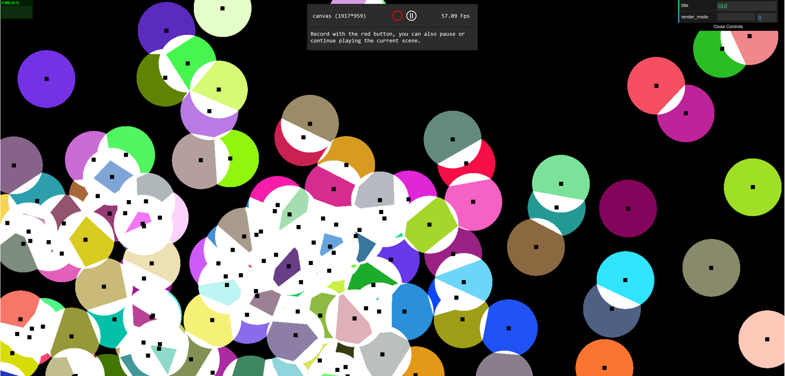 |

| Webgl2.0 Canvas Output Incorrect Sizing | Indexing and Mixup for SetOutputToTexture
|:-------------------------:|:-------------------------:|
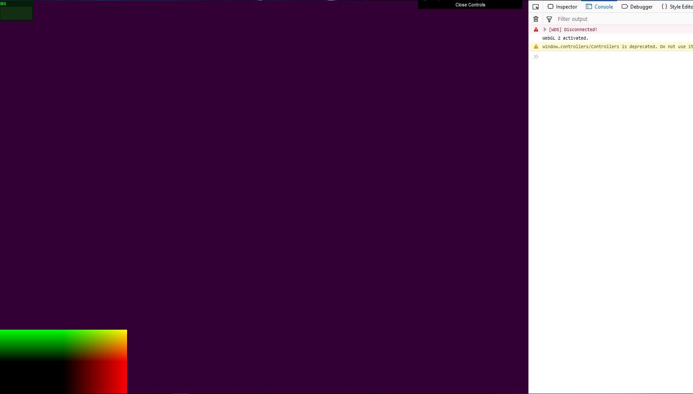 | 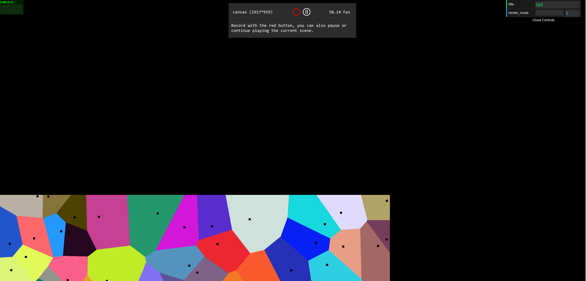 |
