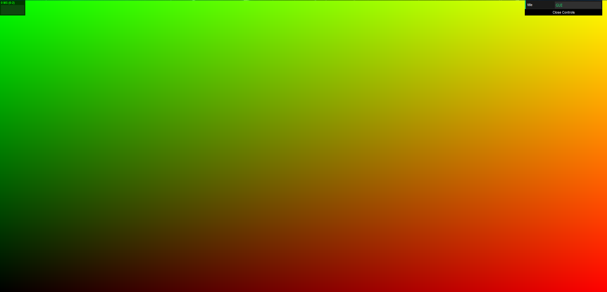

[View Main Readme](./../README.md) or [Read Milestone 2](./Milestone2.md)
 
 
# Odin - Milestone 1
Developers:
  Hannah Bollar: [LinkedIn](https://www.linkedin.com/in/hannah-bollar/), [Website](http://hannahbollar.com/)
  Eric Chiu: [LinkedIn](https://www.linkedin.com/in/echiu1997/), [Website](http://www.erichiu.com/)

## Current Progress:

[View Presentation](./milestone-1/Milestone1_Presentation.pdf)

### Features Implemented

- Rendering pipeline setup using gpu.js
	- created own sub functions to gpu.js kernel to demo manual pixel changing of values so pipeline works with time update and not just a one time call
- Rendering pipeline using webgl2 but has issue with width and height
- Crowd movement pipeline setup (so the crowd should be able to move)
	- uses gpu.js for creation of initial locations and updates
	- no movement currently due to indexing issue into gpu.js loaded images
- Implemented basic figure movement using signed distance functions

WebGL2 Rendering Base Setup | gpu.js base setup | gpu.js demoing can alter individual pixels by noise
:-------------------------:|:-------------------------:|:-------------------------:
| | 

Generic SDF Walking Figure | Blended SDF Walking Figure | Altered Shapes and Blended Walking Figure
:-------------------------:|:-------------------------:|:-------------------------:
| | 

### Issues still to resolve from this Milestone

- resolve pixel issue of using gpu.js output images and "texture-input" for position, velocity, and other attributes (almost like a compute shader and kernal at same time)
- there's an issue using webgl2 that was giving a gl framebuffer width and height (which are read-only values) that were different than the actual canvas dimensions.
	- see the `WebGL2 Rendering Base Setup` image
- should we use gpu.js versus webgl2 for the rendering pipeline aspect?
	- if doing gpu.js for main rendering aspect - need to add helper methods for all aspects of using vector math in the kernel because though this issue says it's resolved, there's still the issue that `var vector = this.vec2(val, val)` is read by the compiler as `float vector = vec2(val, val)`.
	- if doing webgl2 for main rendering aspect - need to resolve gl.framebuffer dimension issue
- need to bake the figures movement so can lerp to different orientations?
- switch to inverse kinematics for figure movement so can allow for limping / different types of figures?